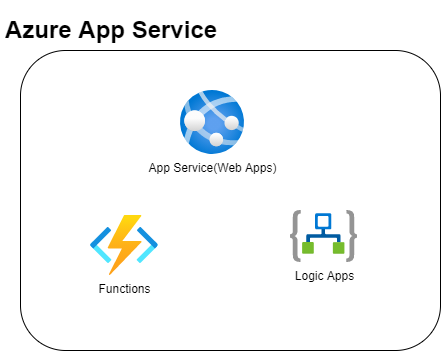

# az-appservice-learn


App Service とは Web Apps, Functions, Logic Appsを含めたサービスの総称です。
このリポジトリはApp Service(Web Apps)の基本的な利用法についてのリポジトリになります。

## Azure リソースグループ作成/削除
(注意) 不要になったらリソースグループごと削除する
```
export ResourceGroup=az-appservice-example
az group create --name $ResourceGroup --location japaneast
az group delete --name $ResourceGroup -y
```
